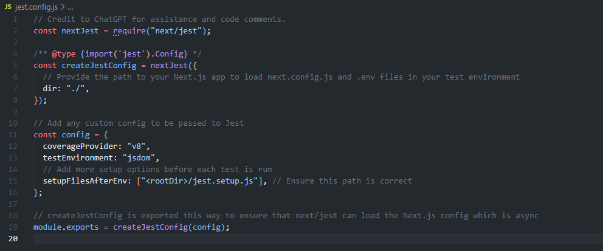

# Jest Assignment 4

## Project Setup

### Installation
1. Clone the repository to your local machine witht he following command:

    git clone https://github.com/your-username/jest-api-mock-testing.git

2. Navigate to the project with the following command:

    cd jest-api-mock-testing

3. Install the dependencies with the following command:

    npm install

### Jest Configuration

#### jest.config.js

## Credits
Credit to ChatGPT for assistance and code comments.